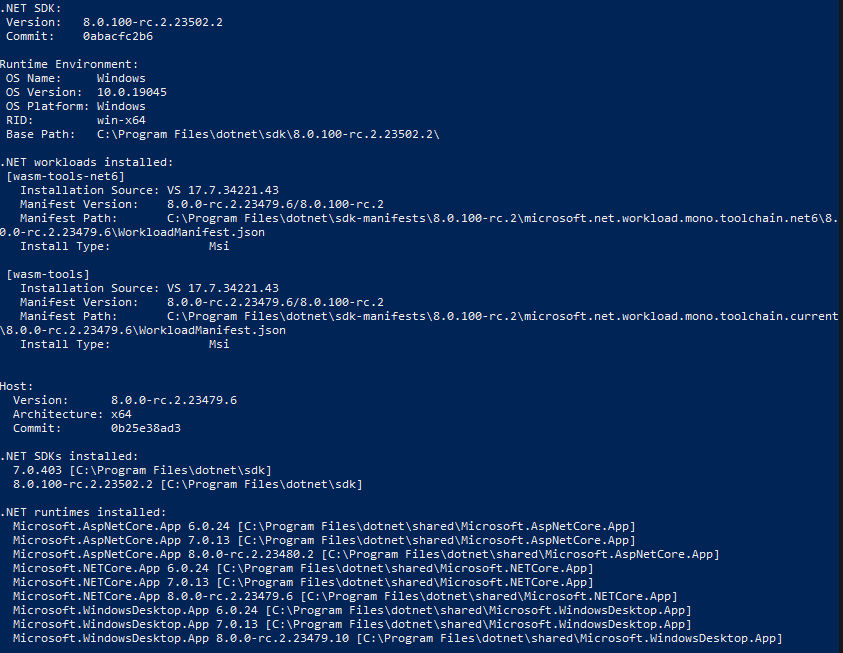

# Cloud Computing

El prop&oacute;sito de este proyecto es demostrar una aplicaci&oacute;n Web MVC con conexiones a bases de datos de SQL Server y MySQL tanto locales como en Amazon Web Services RDS usando Entity Framework Core. 
-   [Recomendaciones](#recomendaciones).
-   [Componentes de la Soluci&oacute;n](#componentes-de-la-solución).
-   Instrucciones
    -   Crear base de datos
        -   MS SQL Server.
        -   MySQL
    -   Ejecutar en Visual Studio.
    -   Ejecutar en ar en Visual Studio Code


## Recomendaciones
El proyecto est&aacute; hecho en .NET 7, por lo que es importante instalar tanto el SDK como el ASP.NET Core Runtime antes de ejecutarlo si no cuentas con ello. Puedes verificar si tienes el SDK instalado ejecutando el siguiente comando en la terminal o Powershell:

```
dotnet --info
```

En caso de estar instalado, el comando regresar&aacute; algo parecido a esto:\



En caso de no tener una respuesta similar a la anterior:
-   Puedes [descargar .NET 7.0](https://dotnet.microsoft.com/es-es/download/dotnet/7.0).
-   O la [versi&oacute;n recomendada por Microsoft (7.0 o superior)](https://dotnet.microsoft.com/es-es/download).

Opcional, tambi&eacute;n se recomienda instalar las siguientes herramientas/software para facilitar el desarrollo si no cuentas con ellas a&uacute;n:
-   [Microsoft SQL Server Developer](https://go.microsoft.com/fwlink/p/?linkid=2215158&clcid=0x80a&culture=es-mx&country=mx).
-   [Microsoft SQL Management Studio](https://learn.microsoft.com/en-us/sql/ssms/download-sql-server-management-studio-ssms?view=sql-server-ver16#download-ssms).
-   [MySQL Community Server](https://dev.mysql.com/downloads/mysql/).
-   [MySQL Workbench](https://dev.mysql.com/downloads/workbench/).
-   [SQLectron](https://sqlectron.github.io/).
-   [Visual Studio 2022 Community Edition](https://visualstudio.microsoft.com/es/vs/community/).
-   [Visual Studio Code](https://code.visualstudio.com/download).
-   [Git](https://git-scm.com/downloads).

## Componentes de la Soluci&oacute;n

La soluci&oacute;n se compone de distintos proyectos individuales:
-   [CloudComputingUTN.DataBase](#cloudcomputingutndatabase).
-   [CloudComputingUTN.Entities](#cloudcomputingutnentities).
-   [CloudComputingUTN.Middleware](#cloudcomputingutnmiddleware).
-   [CloudComputingUTN.Middleware.UnitTests](#cloudcomputingutnmiddlewareunittests).
-   [CloudComputingUTN.MySQL](#cloudcomputingutnmysql).
-   [CloudComputingUTN.WebApp](#cloudcomputingutnwebapp).

### CloudComputingUTN.DataBase
Este proyecto es de tipo base de datos SQL Server. Desde aqu&iacute; se puede publicar la base de datos a cualquier servidor SQL Server.

### CloudComputingUTN.Entities
Este proyecto contiene las entidades que representan las tablas de la base de datos.

### CloudComputingUTN.Middleware
Este proyecto contiene el contexto de EF Core, as&iacute; como el repositorio y la implementaci&oacute;n del repositorio de m&eacute;todos y funciones de interacci&oacute; con la base de datos.

### CloudComputingUTN.Middleware.UnitTests
Este proyecto contiene las pruebas unitarias del repositorio de m&eacute;todos y funciones de interacci&oacute;n con la base de datos.

### CloudComputingUTN.MySQL
Este proyecto contiene los scripts SQL usados para crear la base de datos y configurar el usuario en la base de datos MySQL.

### CloudComputingUTN.WebApp
Este proyecto es el sitio web y API que interact&uacute;a con la base de datos.

## Instrucciones
### Ejecutar en Visual Studio Code
```dotnet run --project CloudComputingUTN.WebApp/CloudComputingUTN.WebApp.csproj```